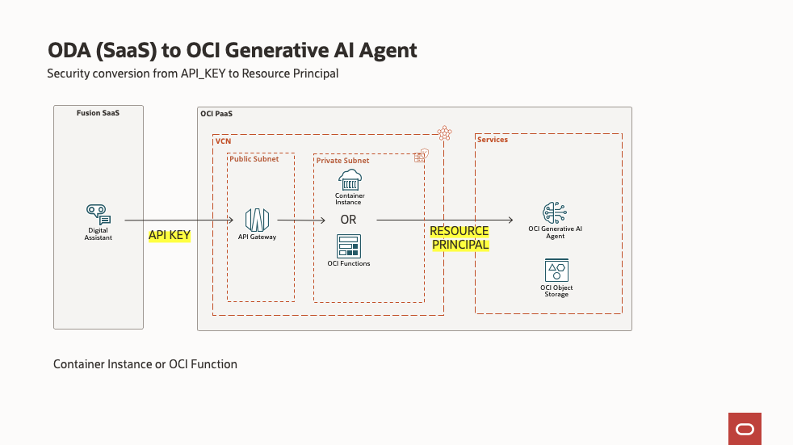
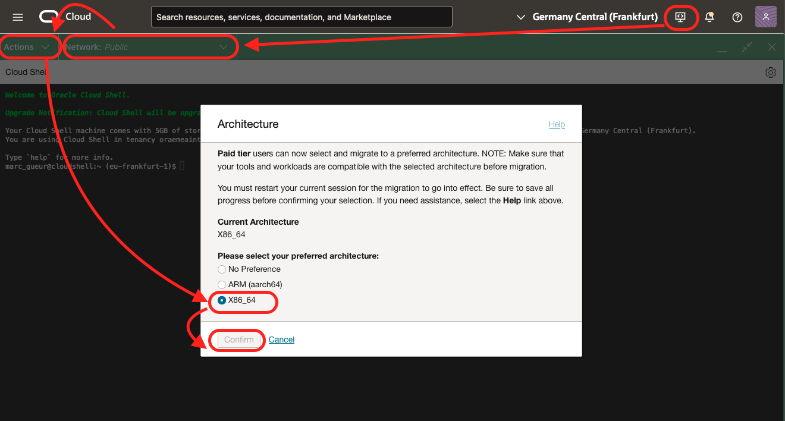

# OCI Forward Request

The goal is to allow Oracle Digital Assistant - ODA (SaaS) to use Oracle Generative AI Agent running in another tenancy.
- Using OCI Functions
- Or OCI Container Instance

Other ways are described below:
- Oracle Integration Cloud
- OCI Cross Tenancy Policies

The repository contains:
- a program that converts API_KEY security to OCI Security
- in the particular case of the API Oracle Generative AI Agent

## Architecture

This program converts the security protocol from API_KEY to RESOURCE_PRINCIPAL and Policies



Resource principal uses an OCI Policy to get access to the OCI Generative AI Agent APIs.

## Installation
From OCI Cloud Shell with *Public Network* and *Architecture X86*

- Double check that OCI Cloud shell uses:
    - *Public Network* (for more info see Note 3 below)
    - *Architecture* X86_64



- Download
```
git clone https://github.com/mgueury/oci-forward-request.git
cd oci-forward-request
```
- Choose OCI Function or Container Instance
```
cd function
or 
cd container
```

- Build (optional: edit file container/env.sh)

```
./starter.sh build
Answer the questions: 
- Compartment ocid
- Auth Token (To create a docker image in the Container Registry)
- API_KEY value
```

Output looks like
```
-- CURL TEST COMMAND --------------------------------------------------
curl -i \
     --request POST \
     --header "Content-Type: application/json" \
     --header "Key: Key 12345678" \
     --data '{"idleTimeoutInSeconds": "3600"}' \
     https://xxxx.apigateway.eu-frankfurt-1.oci.customer-oci.com/forward/app/20240531/agentEndpoints/{agentEndpointId}/sessions

-- OCI Forward Request -------------------------------------------
URL for Gen AI Agent: https://xxxx.apigateway.eu-frankfurt-1.oci.customer-oci.com/forward/app/20240531

In Oracle Digital Assistant: add 2 REST API Services:
- https://xxxx.apigateway.eu-frankfurt-1.oci.customer-oci.com/forward/app/20240531/agentEndpoints/{agentEndpointId}/sessions
- https://xxxx.apigateway.eu-frankfurt-1.oci.customer-oci.com/forward/app/20240531/agentEndpoints/{agentEndpointId}/sessions/{sessionId}/actions/execute

For each of them
- Authentication Type: API_KEY
- Include as: Header
- API_KEY Key : Key
- API_KEY Value : 12345678
```

## Destroy

```
cd starter
./destroy.sh
```

## OIC

There is also a OIC project doing the same:

- import the project
- create policy like this:

- To get the XXXXX_APPID
    - Go to Identity and Security / Domain / Oracle Cloud Services
    - You OIC3 Instance - Integration cloud
    - Take note of the ##Client ID## -> XXXXX_APPID
    - Take note of the ##Client Secret##

```
ex: allow any-user to manage generative-ai-family in compartment xxxx where resource.id = 'XXXXX_APPID'
ex: allow any-user to manage genai-agent-family in compartment xxxx where resource.id = 'XXXXX_APPID'
````

- In the OIC directory, there are also 2 samples APIs that you can import in ODA. The URL of these 2 APIs looks like this:
    - Create Session: https://xxxxxx-fr.integration.eu-frankfurt-1.ocp.oraclecloud.com/ic/api/integration/v2/flows/rest/project/HQAIAGENT/AGENTCREATESESSIONAPI/1.0/session
    - Call Agent: https://xxxxxx-fr.integration.eu-frankfurt-1.ocp.oraclecloud.com/ic/api/integration/v2/flows/rest/project/HQAIAGENT/AGENTEXECUTEAPI/1.0/callAgent/{sessionId}
- For the 2 APIs, you need to configure Basic Authentication and give user + password: 
    - Create a Oracle Identity Domain 'integrated application', then add go to Oracle Cloud Service (OIC name) and add right to the Integrated App.
    - Use the integrated App Client ID and Client Secret as user / password. 
    - Todo: find the OIC doc that explains it

## OCI Cross Tenancy Policies

Another way to enable ODA to call OCI Generative AI in another tenancy is with OCI Cross tenancies Policies. In 2 parts,
- where ODA Instance is hosted
- where the GenAI Service is hosted.

In OCI Console, go to Identity and Security, Policies. Then add these policies:
- Where the ODA instance is hosted, add the rules:
   ```
   endorse any-user to manage agent-family in any-tenancy where request.principal.type='odainstance'
   endorse any-user to manage genai-agent-family in any-tenancy where request.principal.type='odainstance'
   endorse any-user to manage object-family in any-tenancy where request.principal.type='odainstance'
   ```
 
- Where the Gen AI Service is hosted, add the rules
    ```
    define tenancy oda-instance-tenancy as ocid1.tenancy.oc1..xxxxx
    admit any-user of tenancy oda-instance-tenancy to manage agent-family in tenancy where request.principal.id in ('ocid1.odainstance.oc1.eu-frankfurt-1.xxxxx')
    admit any-user of tenancy oda-instance-tenancy to manage genai-agent-family in tenancy where request.principal.id in ('ocid1.odainstance.oc1.eu-frankfurt-1.xxxxx')
    admit any-user of tenancy oda-instance-tenancy to manage object-family in tenancy where request.principal.id in ('ocid1.odainstance.oc1.eu-frankfurt-1.xxxx’)
    ```

## Notes

1. This works only if a policy is added to allow the Container Instance to manage GenAI Agent. Ex:
   ```
   allow group Default/forward-ci-dyngroup to manage genai-agent-family in compartment xxxxx
   ```
3. If you call the API with wget / curl / postman, ... Key=Key / Value=Key 12345678
4. Requirements: Use Cloud Shell with Public Network.
   
    This setup assumes that you have access to OCI Cloud Shell with Public Network access. To check if you have it, start Cloud Shell and you should see Network: Public on the top. If not, try to change to Public Network. If it works, there is nothing to do.
   
    OCI Administrator have that right automatically. Or your administrator has maybe already added the required policy.
   
    **Solution:**
   
    If not, please ask your Administrator to follow this document:
    [https://docs.oracle.com/en-us/iaas/Content/API/Concepts/cloudshellintro_topic-Cloud_Shell_Networking.htm#cloudshellintro_topic-Cloud_Shell_Public_Network](https://docs.oracle.com/en-us/iaas/Content/API/Concepts/cloudshellintro_topic-Cloud_Shell_Networking.htm#cloudshellintro_topic-Cloud_Shell_Public_Network)
    He/She just need to add a Policy to your tenancy :
    ```
    allow group <GROUP-NAME> to use cloud-shell-public-network in tenancy
    ```
